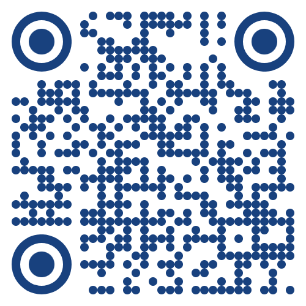

## Projeto para a disciplina "Projeto Front-End" do Ibmec

[Especificações do Projeto](https://github.com/fseda/Nexus)

### QR Code para acessar a aplicação ou [clique aqui](https://fseda.github.io/nexus-app)



[Protótipo no Figma](https://www.figma.com/proto/iAdXW9OlZqI7b2lDzNd5mX/Untitled?type=design&t=i4MaMrGADoc4xIBc-0&scaling=scale-down&page-id=0%3A1&node-id=3-2)

Este projeto consiste em uma aplicação web de feed de postagens onde os usuários podem visualizar histórias sobre locais históricas do Rio de Janeiro e filtrá-los por título usando uma barra de pesquisa. Além disso, a interface inclui botões de navegação no rodapé e uma animação suave durante a busca, melhorando a experiência do usuário.

## Tecnologias Utilizadas

- **React**: Uma biblioteca de JavaScript para construir interfaces de usuário.
- **Styled-Components**: Permite a escrita de CSS em JavaScript para estilizar componentes React.
- **React Transition Group**: Utilizado para fazer transições e animações ao adicionar ou remover componentes do DOM.
- **useState**:  Hook do React que permite adicionar o estado a componentes funcionais.
- **Leaflet**: Uma biblioteca de mapas de código aberto para fornecer mapas interativos.

## Características

- Exibição de postagens com informações e imagens relevantes.
- Filtragem de postagens por título usando uma barra de pesquisa.
- Animações suaves para transições de entrada e saída de postagens.
- Layout responsivo que se adapta a diferentes tamanhos de tela.
- Componente de "Não Encontrado" para feedback visual quando não há postagens correspondentes à pesquisa.
- Exibição de mapas interativos com a localização das histórias usando a biblioteca Leaflet.


## Instalação

Para rodar o projeto localmente, siga estas etapas:

1. Clone o repositório para sua máquina local:

```sh
git clone https://github.com/fseda/nexus-app.git
```

2. Entre no diretório do projeto:

```sh
cd nexus-app
```

3. Instale as dependências do projeto:

```sh
npm install
```

4. Execute a aplicação:

```sh
npm run start
```

A aplicação estará disponível em `http://localhost:3000` no seu navegador.

## Estrutura do Projeto

A aplicação está estruturada da seguinte maneira:

- `components/`: Contém todos os componentes reutilizáveis como `FooterButton`, `MenuComponent`, `PostComponent`, `SearchBar` e `NotFound`.
- `App.js`: O componente raiz da aplicação que orquestra todos os outros componentes.
- `index.js`: O ponto de entrada para a aplicação React.
- `App.css`: Arquivo CSS global para estilos gerais.

## Slide
Link para o slide: https://docs.google.com/presentation/d/1AclrcGwHlvewiejt2qv2XXGU0VBQTR1f8QvO5CuMZZ8/edit?usp=sharing

## Trello
Link para o trello: https://trello.com/b/cDoXwrzN/feed-passeio-carioca
